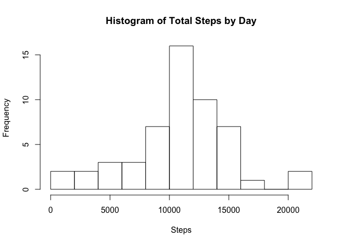
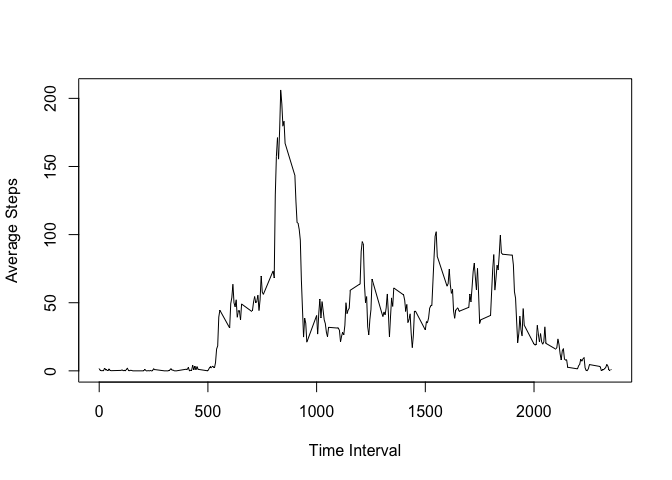
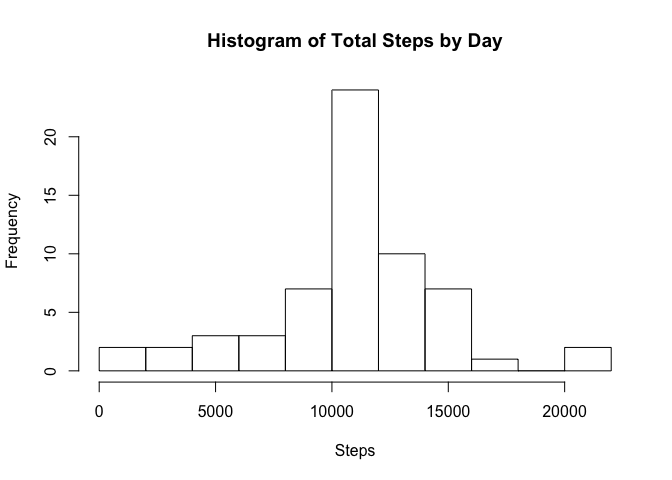
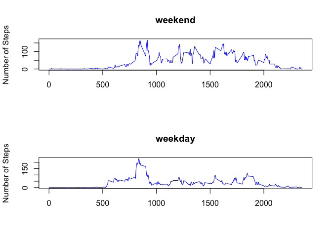

# Reproducible Research: Peer Assessment 1
Jahir Gonzalez  


## Loading and preprocessing the data
1. Load the data (i.e. read.csv())

Before loading the data, I'm going to import the data.table package to enable me to work with the data in an easier way for me.


```r
 library(data.table)
```

Now, loading the data and converting it to data.table

```r
 dat <- read.csv("activity.csv", header = TRUE)
 d <- data.table(dat)
```


## What is mean total number of steps taken per day?

1. Make a histogram of the total number of steps taken each day

```r
 totals <- d[,list(Steps=sum(steps)),by=date]
hist(totals$Steps,xlab = "Steps", main = "Histogram of Total Steps by Day", breaks = 10)
```

 

2. Calculate and report the mean and median total number of steps taken per day

```r
 median(totals$Steps,na.rm = TRUE)
```

```
## [1] 10765
```

```r
 mean(totals$Steps, na.rm =TRUE)
```

```
## [1] 10766.19
```


## What is the average daily activity pattern?
1. Make a time series plot (i.e. type = "l") of the 5-minute interval (x-axis) and the average number of steps taken, averaged across all days (y-axis)

```r
 p <- d[,list(Steps=mean(steps,na.rm=TRUE)),by=interval]
 plot(p$interval,p$Steps,type="l",ylab = "Average Steps", xlab = "Time Interval")
```

 

2. Calculate and report the mean and median total number of steps taken per day
Calculating the time interval with the most steps on average

```r
 maxInt <- p[order(p$Steps,na.last = TRUE, decreasing = TRUE)][1]
 maxInt
```

```
##    interval    Steps
## 1:      835 206.1698
```

## Imputing missing values
1. Calculate and report the total number of missing values in the dataset (i.e. the total number of rows with NAs)
Counting the number of NA values

```r
 na <- is.na(d$steps)
 sum(na)
```

```
## [1] 2304
```
2. Devise a strategy for filling in all of the missing values in the dataset. The strategy does not need to be sophisticated. For example, you could use the mean/median for that day, or the mean for that 5-minute interval, etc.

I will be inserting the average value per time interval into the NA cell values.
For every NA value it will look into the table with the average steps per time interval and insert the appropiate value corresponding to that time interval that shows NA.

3. Create a new dataset that is equal to the original dataset but with the missing data filled in.

```r
 # Merging the orginal data (d) where there are NA values (d[na])
 # with the average steps per interval using "interval" as the join key
 q <- merge(x = d[na], y = p, by = "interval", all.x = TRUE)
 # Coverting it back to a data fram to be able to use only the rows I want
 t <- as.data.frame(q)
 no_nas <- t[,c("Steps","date","interval")]
 # Assigning the right column names before joining it with the data that was not NA
 colnames(no_nas) <- c("steps","date","interval")
 # Subsetting the rows where there were no NA values
 with_nas <- d[!na]
 # Merging and transforming back to data.table
 x <- merge(no_nas,with_nas,by=c("steps","date","interval"), all = TRUE)
 x <- as.data.table(x)
 # Ordering back as the original
 x <- x[order(x$date,x$interval)]
```

4. Make a histogram of the total number of steps taken each day and Calculate and report the mean and median total number of steps taken per day. Do these values differ from the estimates from the first part of the assignment? What is the impact of imputing missing data on the estimates of the total daily number of steps?


```r
 totals <- x[,list(Steps=sum(steps)),by=date]
hist(totals$Steps,xlab = "Steps", main = "Histogram of Total Steps by Day", breaks = 10)
```

 

```r
 median(totals$Steps,na.rm = TRUE)
```

```
## [1] 10766.19
```

```r
 mean(totals$Steps, na.rm =TRUE)
```

```
## [1] 10766.19
```

The mean is different this time. Before mean and median were different while this time they are the same.

The impact in the number of steps is high as now more days have a value where it used to have a NA value.


## Are there differences in activity patterns between weekdays and weekends?

1. Create a new factor variable in the dataset with two levels -- "weekday" and "weekend" indicating whether a given date is a weekday or weekend day.

```r
 z <- strptime(x$date,"%Y-%m-%d")
 x <- as.data.frame(x)
 x$day <- c("weekend","weekday","weekday","weekday","weekday","weekday","weekend")[as.POSIXlt(z)$wday+1]
 x <- as.data.table(x)
```
2. Make a panel plot containing a time series plot (i.e. type = "l") of the 5-minute interval (x-axis) and the average number of steps taken, averaged across all weekday days or weekend days (y-axis).

```r
  wkday <- x[,x$day == c("weekday")]
 weekdays <- x[wkday][,list(Steps=mean(steps)),by = interval]
 weekends <- x[!wkday][,list(Steps=mean(steps)),by = interval]
 par(mfrow=c(2,1))
 plot(weekends$interval,weekends$Steps,type="l", main = "weekend",xlab = "", ylab = "Number of Steps", col = "blue")
 plot(weekdays$interval,weekdays$Steps,type="l", main = "weekday",xlab = "", ylab= "Number of Steps", col = "blue")
```

 
